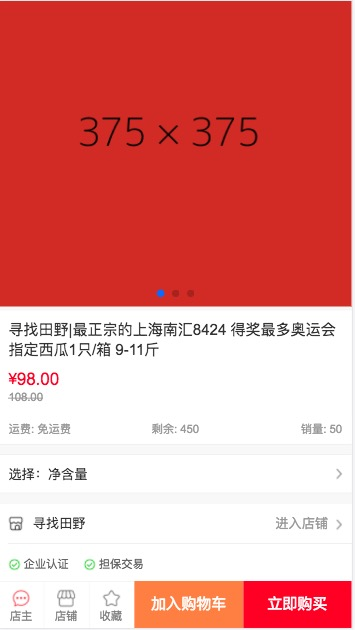

# Vue重构移动端商城页面
基于Vue框架实现了移动端有赞商城，[效果预览点这里](http://calmyang.gitee.io/youzanvue/dist/index.html)。由于数据模拟使用Rap接口平台，GitHub Pages不支持http协议的请求，所以我将项目放在码云上，利用码云的Page服务实现线上的可预览效果。

基本实现了原网站中商城首页、分类页、商品详情页、购物车页以及地址管理页的大部分功能，利用Rap接口管理平台模拟数据，使用mint-ui、swiper、velocity-animate等插件实现轮播图以及购物车商品左滑删除功能，并在地址管理页使用Vue-router实现了新增地址、地址编辑的页面路由。

- 首页    

抽离了底部导航组件，利用mint-ui插件的无限滚动组件实现下拉加载新数据，利用swiper插件实现了顶部轮播图组件并抽离出作为单独的组件。

- 分类页

使用了抽离的底部导航组件，通过Rap接口平台获取模拟数据，渲染至页面。点击综合排行中的热销商品会跳转至商品详情页，点击其他分类栏中的品牌会跳转至搜索页面，留意url的变化，通过url携带keyword和id。

- 商品详情页

头部使用了抽离的轮播组件，点击选择规格、加入购物车和立即购买实现相应的浮层效果，可对商品数量增减

- 搜索页

理论上通过url携带的keyword和id，请求相应的数据，渲染值页面，当然这里我用的是自己编写的模拟数据。

- 购物车页

本页实现了：
1. 普通状态下，购物车商品的选择状态显示、店铺选择状态显示：单商品选择状态、店铺下所有商品选择后店铺选择状态、店铺选择后店铺下所有商品的选择状态以及全选状态的切换
2. 编辑状态下，只有编辑的店铺处于编辑状态，可对商品进行数量增减或删除操作，当店铺下的最后一件商品被删除，店铺也被删除
3. 所有选中商品总价的计算
4. 普通状态下左滑可删除商品功能。

- 地址管理页(个人中心页)

该页面只做了收货地址管理功能

利用vue-router配置路由，实现了修改和新增两个不同功能的页面展示

